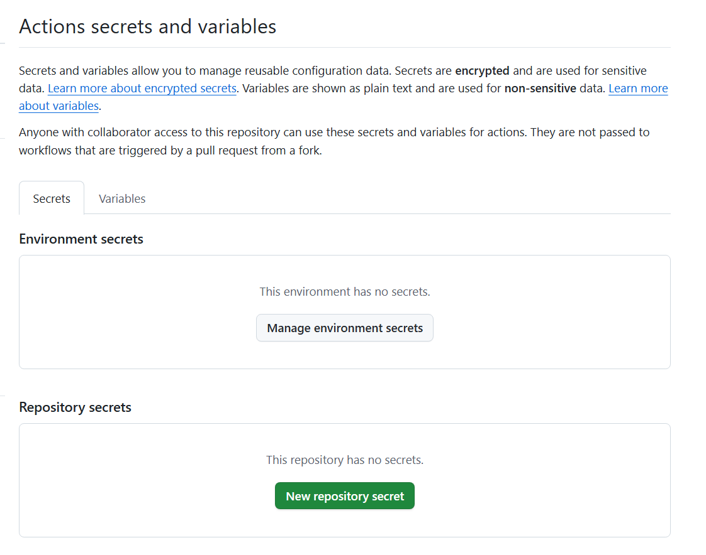

# AWS-Infra-03-RDSCacheMQBeanstalkInfra

# Application Overview

🔹 Frontend & Network Entry
- CloudFront: Acts as a CDN (Content Delivery Network) to cache and distribute content globally, reducing latency and improving performance for users.
- Application Load Balancer (ALB): Distributes incoming HTTP/HTTPS traffic across multiple instances in the Auto Scaling Group to ensure high availability and fault tolerance.
- Internet Gateway: Allows communication between instances in the public subnet and the internet.

🔹 Networking & Routing
- VPC (Virtual Private Cloud): Isolates and controls network settings for all resources, enhancing security.
- Public Subnets: Host internet-facing resources like the ALB and NAT Gateway.
- Private Subnets: Host backend services like application servers, databases, MQ, and caching, not directly exposed to the internet.
- Route Tables: Manage routing between subnets, S3, and the internet.
- NAT Gateway: Allows instances in the private subnet to access the internet (e.g., to download updates) without exposing them directly.
- S3 Gateway Endpoint: Enables private network access to Amazon S3 without using the Internet Gateway, improving security and reducing data transfer costs.

🔹 Compute Layer
- Auto Scaling Group (ASG): Automatically adds/removes EC2 instances based on demand, ensuring scalability and high availability of the application layer.

🔹 Application Integration
- Amazon MQ: Managed message broker (e.g., ActiveMQ or RabbitMQ) used to decouple application components and manage asynchronous communication.

- Memcached (Amazon ElastiCache): Provides in-memory data caching to reduce database load and increase application performance.

🔹 Data Storage
- Amazon RDS: Managed relational database service used to store application data (e.g., MySQL, PostgreSQL, etc.) with high availability and automated backups.

- Amazon S3: Object storage for storing static assets, backups, deployment artifacts, logs, and other large files.

🔹 Monitoring & Alerting
- Amazon CloudWatch: Monitors logs, metrics, and events; used to trigger alarms based on defined thresholds.
- CloudWatch Alarms: Watch specific metrics and trigger actions (e.g., scale out or send notifications).
- SNS Topic (Simple Notification Service): Sends alerts via email, SMS, or other protocols when an alarm is triggered (e.g., CPU usage exceeds threshold).

🔹 Security
- Security Groups: Acts as virtual firewalls for controlling inbound/outbound traffic for EC2, ALB, Amazon MQ, and RDS.

# Implement Plan

## Step 1: Automate IaC with Terraform

## Setup Terraform Environment with diffent stage and S3 backend storage

- You need to have own AWS account and billing enable
- Create IAM user with name `AWS-Infra-03-IAM-User` and grant role below
    - AmazonS3FullAccess
    - AmazonDynamoDBFullAccess
    - AmazonVPCFullAccess
    - AmazonEC2FullAccess

- Go to AWS Console and create new Bucket Name `aws-infra-03-terraform-state`

- Next step, you need to create `Access Key` for this user, so we can use it for auth with Github Action
    - Access key: ``
    - Secret access key: ``

- You need to create secret environment in Github, choose `New repository secret`
    - AWS_ACCESS_KEY_ID
    - AWS_SECRET_ACCESS_KEY

    

- In this project, I setup Terraform with 2 env: dev, prod, and you need to update correct file `.github/workflows/terraform.yml` with two mode: `create` and `destroy`

### Setup VPC module

- VPC name `aws-infra-03-vpc`
- Private Subnet: [ "10.0.10.0/24", "10.0.20.0/24" ]  `aws-infra-03-private-subnet-1` `aws-infra-03-private-subnet-2`
- Public Subnet: [ "10.0.1.0/24", "10.0.2.0/24" ]  `aws-infra-03-public-subnet-1` `aws-infra-03-public-subnet-2`
- cidr_block = "10.0.0.0/16"
- availability_zones = [ "ap-southeast-1a", "ap-southeast-1c" ]
- region = "ap-southeast-1"
- Enable VPC endpoint for S3 gateway

### Setup Security Group and KeyPair

- Public-sg (Allow internet port 80/443) `aws-infra-03-public-sg`
- Private-sg (Allow from public-sg) `aws-infra-03-private-sg`
- bastion-sg (Allow ssh from my public IP) `aws-infra-03-bastion-sg`
- database-sg (Allow all port from Private-sg, bastion-sg, Also allow internal port in in Database Security group) `aws-infra-03-database-sg`

### Setup RDS database module

- Create RDS database
- Create DB subnet group `aws-infra-03-rds-sub-grp`
- Add availability zone ["ap-southeast-1a", "ap-southeast-1c"]
- Add RDS to Subnets `aws-infra-03-public-subnet-1`

### Setup Elastice Cache

### Setup Amazon MQ

### DB Initialization

### Setup application deploy with Elastic BeanStalk

### Setup S3 bucket and S3 Endpoint Gateway

### Setup Auto Scaling Group with ALB

### Setup Cloud Front with AWS Cert Manager

### Setup monitoring Stack with CloudWatch, SNS, EvenBridh

## Step 2: Setup Github Action to automate deploy IaC Terraform (dev/prod)

## Step 3: Deploy CI/CD pipeline on Github Action for automate build and upload image to ECR

## Refactor application with EKS cluster + OpenTeleMetry Stack
